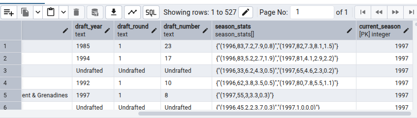
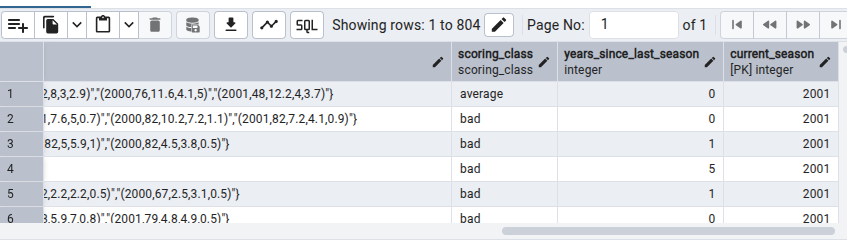

1. run docker-compose up -d

2. type the email and pass from env

3. register a server
    * change name and host name/address to docker container namein the env
    * add password

4. click save

5. now check the tables

---

What is a dimension?
- attributes of an entity (e.g. user's birthday, user's favorite food)
    * some of these dimensions may __IDENTIFY__ an entity (e.g. a user's ID)
        * called identifier dimensions
        * they uniquely identify an entity
    * others are just attributes
- __Two Flavors__
    * Slowly-changing
        * time-dependent
        *  e.g. fav food
            * this can change in the future when you encounter another food that you really really like
    * Fixed
        * value that never change
        * e.g. birthday
            * you can't change this

Knowing your Consumer

- Data analysts/Data scientists
    * should be very easy to query (since more on analytical)
    * not many complex data types
- Other data engineers
    * should be compact and prolly harder to query
    * nested types are okay
- ML models
    * depends on the model and how its trained
- Customers
    * should be very easy to interpret chart

OLTP vs master data vs OLAP
- OLTP (online transaction processing)
    * optimizes for low-latency, low-volume queries
    * mostly used by software engineers to model their data and make run their systems as quickly as possible
    * third normal form, minimizing data duplication, linker table, primary and foreign keys and constraints
    * always looking at one user and one person
- OLAP (online analytical processing)
    * optimizes for large volumes, GROUP BY queries, minimizes JOINs
    * most common modeling in data engineers
    * query fast that we don't have to joins table together
    * always looking at the population or the entire dataset, or chunk of dataset or subset of a dataset
- Master Data
    * optimizes for completeness of entity definitions
    * entities are deduped
    * data that other data engineers and data on the company depend on
    * sits in the middle of OLTP AND OLAP


---
NOTE: Some of the biggest problems in data engineering occur when data is modeled for the wrong consumer
---

OLTP and OLAP is a Continuum

Production Databases merged into a single table which is called master data. OLAP cubes, flattens the data out, multiple rows per entity, this is where we aggregate and group. Aggregating them resulting to 1 result.
- e.g. 40 tables in airbnb, compressed it into 1 table called master data, flatten it using OLAP cubes, then average listing for the metrics

Cumulative Table Design
- Core components
    * 2 dataframes (yesterday and today)
    * __FULL OUTER JOIN__ the two data frames together
    * __COALESCE__ values to keep everything around
    * hang onto all of history
- Usages
    - growth analytics at Facebook (dim_all_users)
    - state transition trackking

Diagram of Cumulative Table Design


- Strengths
    * historical analysis without shuffle and group by
    * easy "transition" analysis
- Drawbacks
    * can only be backfilled sequentially
    * handling PII data can be a mess since deleted/inactive users get carried forward

The compactness vs usability tradeoff
- The most usable tables usually
    * have no complex data types
    * easily can be manipulated with WHERE and GROUP BY
    * analytics focused
- The most compact tables (not human readable)
    * are compressed to be as small as possible and can't be queried directly until they're decoded
    * production data focused
- The middle-ground tables
    - use complex data types (e.g. ARRAY, MAP, and STRUCT), making query trickier but also compacting more

When would you use each type of table?
- Most compact
    * online systems where latency and data volumes matter a lot
    * consumers are usually highly technical
- middle ground
    * upstream staging / master data where the majority of consumers are other data engineers
- most usable
    * when analytics is the main consumer and the majority of consumers are less technical

Struct vs Array vs Map
- Struct
    * keys are rigidly defined
    * compression is good
    * values can be any type
    * a table within a table
- Map
    * keys are loosely defined (can have numerous keys)
    * compression is okay
    * values all have to be the same type
- Array
    * ordinal
    * list of values that all have to be the same type
    * list in a column

Temporal Cardinality Explosions of Dimensions
- when you add a temporal aspect to your dimensions and the cardinaluty increases by at leat 1 order of magnitude
- Example
    * airbnb has ~6 million listings
        * if  we want to know the nightly pricing and available of each night for the next year
            * that's 365 * 6 million or about ~ 2 billion nights
        * should this dataset be"
            * listing-level with an array of nights?
            * listing night level with 2 billion rows?
        * if you do the sorting right, Parquet will keep these two about the same size

Badness of denormalzed temporal dimensions
- if you explode it out and need to join other dimensions,
- spark shuffle will ruin yout compression!
- shuffle breaks sorting

Run-length encoding compression
- prolly the most important compression technique in big data right now
    * it's why parquet file format has become so successful
- shuffle can ruin this __BE CAREFUL!__
    * shuffle happens in distributed environments when you fo JOIN and GROUP BY
- bunch of duplicate data, it gets nullified except the first one
 to 

Spark Shuffle
- after a join, Spark may mix up the ordering of the rows and ruin your compression

- only the 5 and 6 are compressed,even tho, there's a lot of duplicates

---
Lab

```sql
-- Creating own data type on player_seasons table

CREATE TYPE season_stats AS (
	season INTEGER,
	gp INTEGER,
	pts REAL,
	reb REAL,
	ast REAL
)

-- creating table
CREATE TABLE players (
	player_name TEXT,
	height TEXT,
	college TEXT,
	country TEXT,
	draft_year TEXT,
	draft_round TEXT,
	draft_number TEXT,
	season_stats season_stats[],
	current_season INTEGER,
	PRIMARY KEY(player_name, current_season)
)

-- getting the min season available
SELECT MIN(season) FROM player_seasons

-- sort of variable to hold the queried data
-- seed query
WITH yesterday AS (
	SELECT * FROM players
	WHERE current_season = 1995
),
today AS (
	SELECT * FROM player_seasons
	WHERE season = 1996
)

-- query
SELECT * FROM today t FULL OUTER JOIN yesterday y
ON t.player_name = y.player_name

-- coalesce the value that are not temporal, the values that aren't changing
SELECT
	COALESCE(t.player_name, y.player_name) AS player_name,
	COALESCE(t.height, y.height) AS height,
	COALESCE(t.college, y.college) AS college,
	COALESCE(t.country, y.country) AS country,
	COALESCE(t.draft_year, y.draft_year) AS draft_year,
	COALESCE(t.draft_round, y.draft_round) AS draft_round,
	COALESCE(t.draft_number, y.draft_number) AS draft_number
	FROM today t FULL OUTER JOIN yesterday y
	ON t.player_name = y.player_name

-- catching null values
INSERT INTO players
WITH yesterday AS (
	SELECT * FROM players
	WHERE current_season = 1995
),
today AS (
	SELECT * FROM player_seasons
	WHERE season = 1996
)

-- cummulate the data
SELECT
	COALESCE(t.player_name, y.player_name) AS player_name,
	COALESCE(t.height, y.height) AS height,
	COALESCE(t.college, y.college) AS college,
	COALESCE(t.country, y.country) AS country,
	COALESCE(t.draft_year, y.draft_year) AS draft_year,
	COALESCE(t.draft_round, y.draft_round) AS draft_round,
	COALESCE(t.draft_number, y.draft_number) AS draft_number,
	CASE
		WHEN y.season_stats is NULL THEN ARRAY[ROW(
				t.season,
				t.gp,
				t.pts,
				t.reb,
				t.ast
			)::season_stats] -- cast it into season_stats
		WHEN t.season IS NOT NULL THEN y.season_stats || ARRAY[ROW( --concat
				t.season,
				t.gp,
				t.pts,
				t.reb,
				t.ast
			)::season_stats]
		ELSE y.season_stats
	END as season_stats,
	COALESCE(t.season, y.current_season + 1) as current_season
	-- CASE -- nicer way is above
	-- 	WHEN t.season IS NOT NULL THEN t.season
	-- 	ELSE y.current_season + 1
	-- END
FROM today t FULL OUTER JOIN yesterday y
ON t.player_name = y.player_name



SELECT * FROM players
WHERE current_season = 2001
AND player_name = 'Michael Jordan';

getting the season_stats data from the players table
they are already sorted
WITH unnested as (
	SELECT player_name,
		UNNEST(season_stats)::season_stats AS season_stats
		-- keeps the sorting untouched
	FROM players
	WHERE current_season = 2001
	AND player_name = 'Michael Jordan'
)

SELECT player_name, (season_stats::season_stats).* from unnested

-- for analytical perspective
CREATE TYPE scoring_class AS ENUM ('star', 'good', 'average', 'bad');

CREATE TABLE players (
	player_name TEXT,
	height TEXT,
	college TEXT,
	country TEXT,
	draft_year TEXT,
	draft_round TEXT,
	draft_number TEXT,
	season_stats season_stats[],
	scoring_class scoring_class,
	years_since_last_season INTEGER,
	current_season INTEGER,
	PRIMARY KEY(player_name, current_season)
)

SELECT MIN(season) FROM player_seasons

INSERT INTO players
WITH yesterday AS (
	SELECT * FROM players
	WHERE current_season = 2000
),
today AS (
	SELECT * FROM player_seasons
	WHERE season = 2001
)

SELECT
	COALESCE(t.player_name, y.player_name) AS player_name,
	COALESCE(t.height, y.height) AS height,
	COALESCE(t.college, y.college) AS college,
	COALESCE(t.country, y.country) AS country,
	COALESCE(t.draft_year, y.draft_year) AS draft_year,
	COALESCE(t.draft_round, y.draft_round) AS draft_round,
	COALESCE(t.draft_number, y.draft_number) AS draft_number,
	CASE
		WHEN y.season_stats is NULL THEN ARRAY[ROW(
				t.season,
				t.gp,
				t.pts,
				t.reb,
				t.ast
			)::season_stats] -- cast it into season_stats
		WHEN t.season IS NOT NULL THEN y.season_stats || ARRAY[ROW( --concat
				t.season,
				t.gp,
				t.pts,
				t.reb,
				t.ast
			)::season_stats]
		ELSE y.season_stats
	END as season_stats,
	CASE
		WHEN t.season IS NOT NULL THEN
			CASE
				WHEN t.pts > 20 THEN 'star'
				WHEN t.pts > 15 THEN 'good'
				WHEN t.pts > 10 THEN 'average'
				ELSE 'bad'
			END::scoring_class
			ELSE y.scoring_class
	END as scoring_class,

	CASE
		WHEN t.season IS NOT NULL THEN 0
			ELSE y.years_since_last_season + 1
		END as years_since_last_season,
	COALESCE(t.season, y.current_season + 1) as current_season
	-- CASE -- nicer way is above
	-- 	WHEN t.season IS NOT NULL THEN t.season
	-- 	ELSE y.current_season + 1
	-- END
FROM today t FULL OUTER JOIN yesterday y
ON t.player_name = y.player_name;

SELECT * FROM players WHERE current_season = 2001



SELECT
	player_name,
	(season_stats[CARDINALITY(season_stats)]::season_stats).pts/
	CASE WHEN (season_stats[1]::season_stats).pts = 0 THEN 1 ELSE (season_stats[1]::season_stats).pts END
FROM players
WHERE current_season = 2001
ORDER BY 2 DESC

```
